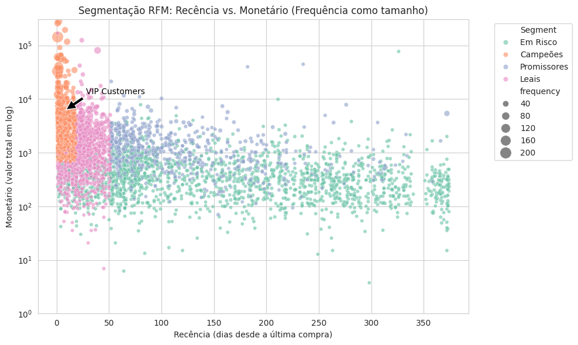
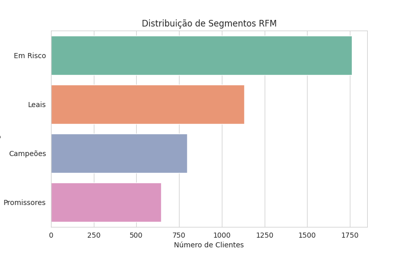
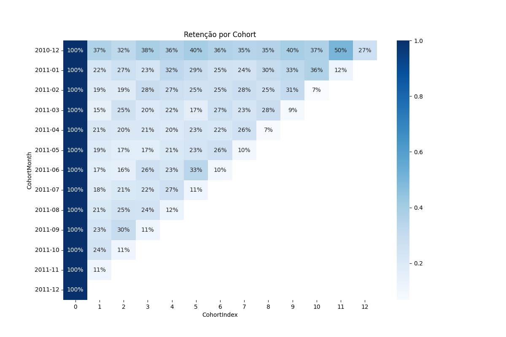

# Análise de Dados de E-commerce

Este projeto analisa dados de vendas de uma loja online fictícia (`OnlineRetail.csv`) para extrair insights sobre segmentação de clientes (RFM) e retenção (Cohort), utilizando um pipeline ETL e um dashboard interativo.

## Tecnologias
- **Python**: pandas, seaborn, plotly, streamlit
- **PostgreSQL**: Armazenamento de dados
- **Streamlit**: Dashboard interativo
- **Jupyter Notebook**: Análises exploratórias

## Estrutura do Projeto
- `data/`: Dados brutos (`raw/`) e processados (`processed/`).
- `scripts/`: Pipeline ETL (`extract.py`, `transform.py`, `load.py`) e dashboard (`dashboard.py`, `dashboard_cloud.py`).
- `sql/`: Scripts SQL para criar tabelas.
- `notebooks/`: Notebooks para ETL (`01_etl_pipeline.ipynb`), RFM (`02_rfm_analysis.ipynb`), e Cohort (`03_cohort_analysis.ipynb`).
- `visualizations/`: Gráficos gerados.
<<<<<<< HEAD

=======
  
>>>>>>> 49833d92235acd032dacc4e95ceac9167c2d74a2
## Resultados
### Análise RFM
- **Distribuição dos Segmentos**:
- `Em Risco`: ~1.750 clientes (maior grupo), indicando alto risco de churn.
- `Leais`: ~1.500 clientes, uma base sólida de clientes engajados.
- `Campeões`: ~1.000 clientes, recentes e de alto valor.
- `Promissores`: ~750 clientes, com potencial para maior engajamento.

- **Contribuição de Receita**:
- `Campeões` (20.5% dos clientes) geram 48.3% da receita, destacando sua importância.

- **Visualizações**:
- Scatter Plot: Mostra Recência vs. Monetário, com Frequência como tamanho e Segmento como cor.
- Bar Plot: Distribuição dos segmentos.

### Análise de Cohort
- **Retenção**:
- Queda inicial significativa (e.g., cohort de 2010-12: 37% no mês 1), indicando alta rotatividade.
- Picos sazonais (e.g., 50% no mês 11 para 2010-12), sugerindo compras de fim de ano.

- **Visualização**:
- Heatmap: Retenção por cohort ao longo do tempo.

### Dashboard
O dashboard interativo inclui:
- **RFM**: Scatter plot e distribuição de segmentos.
- **Cohort**: Heatmap de retenção e retenção média.
- **Produtos Mais Vendidos**: Top 10 por quantidade e receita.
- **Tendências de Vendas**: Vendas mensais ao longo do tempo.
- **Análise por País**: Receita e número de clientes por país.

## Visualizações

## Dashboard Interativo
*https://ecommerce-data-analysis-borgesip.streamlit.app/*

## Insights e Recomendações
- **RFM**:
- `Campeões`: Implementar programa de fidelidade (20.5% dos clientes, 48.3% da receita).
- `Em Risco`: Campanhas de reengajamento com descontos.
- **Cohort**:
- Reduzir churn inicial com e-mails de onboarding.
- Aproveitar picos sazonais (e.g., Natal) com promoções.
- **Produtos**: Focar nos top 10 produtos para promoções.
- **Países**: Expandir marketing para países com menor presença.

## Contato
LinkedIn: [Ian Borges](https://linkedin.com/in/borgesip)
